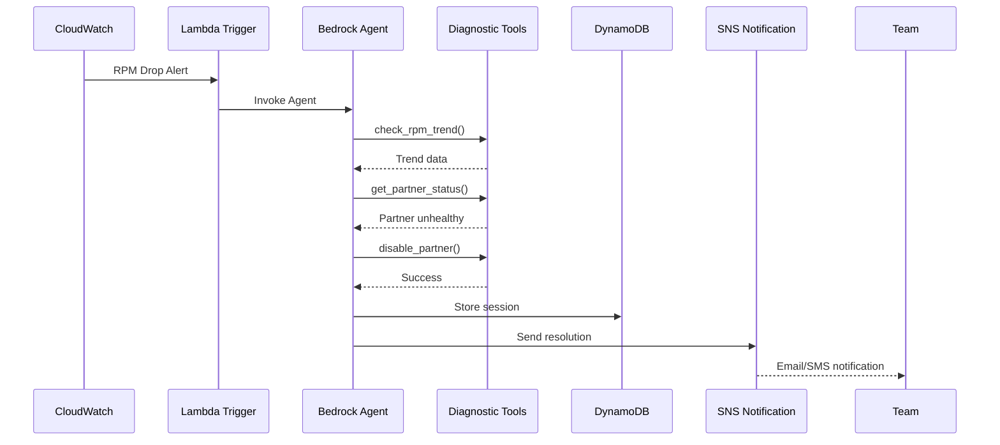

# Fase 1: PoC y MVP - Arquitectura Técnica AWS

## Visión General de la Fase 1

La Fase 1 se enfoca en validar la viabilidad técnica del Agente de AdOps Autónomo mediante un Proof of Concept (PoC) y un Minimum Viable Product (MVP). Esta fase establece los fundamentos arquitectónicos y demuestra la capacidad del sistema para resolver un problema operativo específico de manera autónoma.

### Objetivos Principales
- **Validación Técnica**: Demostrar que Amazon Bedrock puede orquestar diagnóstico y remediación autónoma
- **Valor de Negocio**: Probar reducción medible en MTTR para un escenario crítico
- **Fundación Arquitectónica**: Establecer patrones y componentes reutilizables para fases posteriores
- **Minimización de Riesgo**: Implementación controlada con alcance limitado

### Alcance Específico
- **Un Editor Piloto**: Editor de alto valor con problemas operativos frecuentes
- **Un Tipo de Problema**: Caída de RPM (Revenue Per Mille) por issues con demand partners
- **Modo Shadow**: Operación en paralelo con procesos manuales para validación
- **Métricas Baseline**: Establecimiento de métricas de comparación

## Arquitectura AWS Simplificada para MVP

### Componentes Core del MVP

#### 1. Detección Simple con CloudWatch

```yaml
CloudWatch Configuration MVP:
  CustomMetric:
    Namespace: SSMAS/AdOps/MVP
    MetricName: RPM_EditorX
    Dimensions:
      - Name: EditorId
        Value: editor-pilot-001
      - Name: Environment
        Value: production

  Alarm:
    Name: RPM-Drop-EditorX-MVP
    MetricName: RPM_EditorX
    Statistic: Average
    Period: 300  # 5 minutes
    EvaluationPeriods: 2
    Threshold: 50  # RPM < $50
    ComparisonOperator: LessThanThreshold
    TreatMissingData: breaching

  AlarmActions:
    - SNS Topic: adops-mvp-alerts
    - Lambda: trigger-bedrock-agent-mvp
```

**Justificación del Diseño**:
- Métrica única simplifica la implementación y debugging
- Umbral estático basado en análisis histórico del editor
- Periodo de 5 minutos balancea rapidez vs falsos positivos
- 2 periodos consecutivos reducen alertas espurias

#### 2. Agente Bedrock MVP

```yaml
Bedrock Agent MVP Configuration:
  Model: anthropic.claude-3-haiku  # Faster, cost-effective for MVP

  Agent:
    Name: adops-mvp-agent
    Description: "MVP agent for RPM drop remediation"

    Instructions: |
      You are an AdOps specialist focused on diagnosing and resolving
      RPM drops for Editor X. When activated:

      1. Analyze the RPM drop pattern
      2. Check demand partner health status
      3. Identify the problematic partner
      4. Apply appropriate remediation:
         - Temporary partner deactivation if unhealthy
         - Cache clearing if configuration issue
      5. Monitor recovery and report results

    MaxSessionDuration: 300  # 5 minutes max

  ActionGroup:
    Name: mvp-diagnostic-tools
    Description: "Limited tool set for MVP"
    Lambda: arn:aws:lambda:us-east-1:account:function:mvp-tools

    Tools:
      - check_rpm_trend
      - get_partner_status
      - analyze_recent_errors
      - disable_partner
      - clear_editor_cache
```

**Decisiones de Diseño**:
- Claude 3 Haiku para balance costo/performance en MVP
- Instrucciones específicas y acotadas al caso de uso
- Timeout corto para prevenir runaway sessions
- Conjunto mínimo de herramientas probadas

#### 3. Lambda Functions MVP

```python
# mvp-tools Lambda function structure

import json
import boto3
from datetime import datetime, timedelta

class MVPDiagnosticTools:
    def __init__(self):
        self.cloudwatch = boto3.client('cloudwatch')
        self.dynamodb = boto3.resource('dynamodb')
        self.sns = boto3.client('sns')

    def check_rpm_trend(self, editor_id: str) -> dict:
        """
        Analyze RPM trend for last 30 minutes
        """
        end_time = datetime.utcnow()
        start_time = end_time - timedelta(minutes=30)

        response = self.cloudwatch.get_metric_statistics(
            Namespace='SSMAS/AdOps/MVP',
            MetricName='RPM_EditorX',
            Dimensions=[
                {'Name': 'EditorId', 'Value': editor_id}
            ],
            StartTime=start_time,
            EndTime=end_time,
            Period=300,
            Statistics=['Average', 'Minimum'],
            Unit='None'
        )

        # Analyze trend
        datapoints = sorted(response['Datapoints'],
                          key=lambda x: x['Timestamp'])

        if len(datapoints) >= 2:
            recent = datapoints[-1]['Average']
            previous = datapoints[-2]['Average']
            drop_percentage = ((previous - recent) / previous) * 100

            return {
                'current_rpm': recent,
                'drop_percentage': drop_percentage,
                'trend': 'declining' if drop_percentage > 20 else 'stable',
                'datapoints': datapoints
            }

        return {'error': 'Insufficient data points'}

    def get_partner_status(self, partner_id: str) -> dict:
        """
        Check health status of specific demand partner
        """
        # Query partner health endpoint (mocked for MVP)
        health_checks = {
            'connectivity': self._check_connectivity(partner_id),
            'response_time': self._check_response_time(partner_id),
            'error_rate': self._check_error_rate(partner_id)
        }

        overall_health = 'healthy'
        if health_checks['connectivity'] == 'failed':
            overall_health = 'critical'
        elif health_checks['response_time'] > 3000:  # 3 seconds
            overall_health = 'degraded'
        elif health_checks['error_rate'] > 0.05:  # 5% errors
            overall_health = 'unhealthy'

        return {
            'partner_id': partner_id,
            'status': overall_health,
            'checks': health_checks,
            'recommendation': self._get_recommendation(overall_health)
        }

    def disable_partner(self, partner_id: str, duration_minutes: int = 15) -> dict:
        """
        Temporarily disable problematic demand partner
        """
        try:
            # Update configuration in DynamoDB
            table = self.dynamodb.Table('adops-mvp-config')

            response = table.update_item(
                Key={'config_type': 'partner_status', 'id': partner_id},
                UpdateExpression='SET #status = :disabled, #until = :until',
                ExpressionAttributeNames={
                    '#status': 'status',
                    '#until': 'disabled_until'
                },
                ExpressionAttributeValues={
                    ':disabled': 'disabled',
                    ':until': (datetime.utcnow() +
                              timedelta(minutes=duration_minutes)).isoformat()
                }
            )

            # Send notification
            self._notify_action(f"Partner {partner_id} disabled for {duration_minutes} minutes")

            return {
                'success': True,
                'action': 'partner_disabled',
                'partner_id': partner_id,
                'duration_minutes': duration_minutes,
                'will_reactivate_at': response['Attributes']['disabled_until']
            }

        except Exception as e:
            return {
                'success': False,
                'error': str(e)
            }

    def clear_editor_cache(self, editor_id: str) -> dict:
        """
        Clear cache for specific editor
        """
        try:
            # Invoke cache clearing endpoint
            # For MVP, this is a simple API call

            return {
                'success': True,
                'action': 'cache_cleared',
                'editor_id': editor_id,
                'timestamp': datetime.utcnow().isoformat()
            }

        except Exception as e:
            return {
                'success': False,
                'error': str(e)
            }

def lambda_handler(event, context):
    """
    Main Lambda handler for Bedrock agent tools
    """
    tools = MVPDiagnosticTools()

    action = event.get('action')
    parameters = event.get('parameters', {})

    if action == 'check_rpm_trend':
        return tools.check_rpm_trend(parameters.get('editor_id'))
    elif action == 'get_partner_status':
        return tools.get_partner_status(parameters.get('partner_id'))
    elif action == 'disable_partner':
        return tools.disable_partner(
            parameters.get('partner_id'),
            parameters.get('duration_minutes', 15)
        )
    elif action == 'clear_editor_cache':
        return tools.clear_editor_cache(parameters.get('editor_id'))
    else:
        return {'error': f'Unknown action: {action}'}
```

#### 4. Almacenamiento y Estado con DynamoDB

```yaml
DynamoDB Tables MVP:
  adops-mvp-sessions:
    PartitionKey: session_id (String)
    SortKey: timestamp (Number)

    Attributes:
      - incident_id: String
      - editor_id: String
      - problem_type: String
      - diagnosis: Map
      - actions_taken: List
      - resolution_status: String
      - resolution_time_ms: Number

    GlobalSecondaryIndex:
      - Name: editor-index
        PartitionKey: editor_id
        SortKey: timestamp

    TimeToLive:
      AttributeName: ttl
      Enabled: true  # 30 days retention

    BillingMode: PAY_PER_REQUEST  # No need for provisioned capacity in MVP

  adops-mvp-config:
    PartitionKey: config_type (String)
    SortKey: id (String)

    Attributes:
      - value: Map
      - last_updated: String
      - updated_by: String

    BillingMode: PAY_PER_REQUEST
```

#### 5. Notificación y Reporte con SNS

```yaml
SNS Configuration MVP:
  Topics:
    - Name: adops-mvp-alerts
      DisplayName: "AdOps MVP Alerts"
      Subscriptions:
        - Protocol: email
          Endpoint: adops-team@ssmas.com
        - Protocol: sms
          Endpoint: "+1234567890"  # On-call phone

    - Name: adops-mvp-resolutions
      DisplayName: "AdOps MVP Resolutions"
      Subscriptions:
        - Protocol: email
          Endpoint: adops-reports@ssmas.com

  MessageAttributes:
    severity: Critical|High|Medium|Low
    editor_id: String
    resolution_status: Resolved|Escalated|Failed

  MessageTemplate: |
    AdOps Agent MVP Alert

    Severity: {severity}
    Editor: {editor_id}
    Problem: {problem_description}
    Diagnosis: {root_cause}
    Actions Taken: {actions}
    Status: {resolution_status}
    Time to Resolution: {resolution_time}

    Details: {details_url}
```

### Flujo de Trabajo MVP



## Infraestructura AWS para MVP

### VPC y Networking Simplificado

```yaml
VPC Configuration MVP:
  CIDR: 10.0.0.0/24  # Smaller subnet for MVP

  Subnets:
    Private:
      - CIDR: 10.0.0.0/26
        AZ: us-east-1a

  SecurityGroups:
    LambdaSG:
      Ingress: []  # No ingress needed
      Egress:
        - Protocol: HTTPS
          Port: 443
          Destination: 0.0.0.0/0

  VPCEndpoints:
    - Service: com.amazonaws.us-east-1.bedrock-runtime
    - Service: com.amazonaws.us-east-1.dynamodb
    - Service: com.amazonaws.us-east-1.sns
```

### IAM Roles y Permisos MVP

```yaml
IAM Roles MVP:
  BedrockAgentMVPRole:
    TrustPolicy:
      Service: bedrock.amazonaws.com
    Policies:
      - PolicyName: BedrockAgentMVPPolicy
        PolicyDocument:
          Version: "2012-10-17"
          Statement:
            - Effect: Allow
              Action:
                - lambda:InvokeFunction
              Resource:
                - arn:aws:lambda:us-east-1:*:function:mvp-tools
            - Effect: Allow
              Action:
                - dynamodb:PutItem
                - dynamodb:GetItem
                - dynamodb:Query
              Resource:
                - arn:aws:dynamodb:us-east-1:*:table/adops-mvp-*

  LambdaMVPRole:
    TrustPolicy:
      Service: lambda.amazonaws.com
    ManagedPolicies:
      - AWSLambdaBasicExecutionRole
    Policies:
      - PolicyName: LambdaMVPPolicy
        PolicyDocument:
          Statement:
            - Effect: Allow
              Action:
                - cloudwatch:GetMetricStatistics
                - cloudwatch:PutMetricData
              Resource: "*"
            - Effect: Allow
              Action:
                - dynamodb:UpdateItem
                - dynamodb:GetItem
              Resource:
                - arn:aws:dynamodb:us-east-1:*:table/adops-mvp-config
            - Effect: Allow
              Action:
                - sns:Publish
              Resource:
                - arn:aws:sns:us-east-1:*:adops-mvp-*
```

## Monitorización y Observabilidad MVP

### CloudWatch Dashboards

```yaml
CloudWatch Dashboard MVP:
  Name: AdOps-MVP-Dashboard

  Widgets:
    - RPMTrend:
        Type: Line
        Metrics:
          - Id: m1
            Label: "Editor X RPM"
            MetricStat:
              Metric:
                Namespace: SSMAS/AdOps/MVP
                MetricName: RPM_EditorX
                Dimensions:
                  - Name: EditorId
                    Value: editor-pilot-001
              Period: 300
              Stat: Average
        Period: 3600  # Last hour

    - AgentActivations:
        Type: Number
        Metrics:
          - Label: "Agent Activations (24h)"
            MetricStat:
              Metric:
                Namespace: AWS/Bedrock
                MetricName: InvocationCount
                Dimensions:
                  - Name: AgentId
                    Value: adops-mvp-agent
              Period: 86400
              Stat: Sum

    - ResolutionSuccess:
        Type: Pie
        Metrics:
          - Label: "Resolved"
            Expression: "SEARCH('{SSMAS/AdOps/MVP} resolution_status=\"resolved\"', 'Sum')"
          - Label: "Escalated"
            Expression: "SEARCH('{SSMAS/AdOps/MVP} resolution_status=\"escalated\"', 'Sum')"

    - MTTRComparison:
        Type: Bar
        Metrics:
          - Label: "Manual MTTR"
            Value: 45  # minutes baseline
          - Label: "Agent MTTR"
            Expression: "AVG(SEARCH('{SSMAS/AdOps/MVP} resolution_time_ms', 'Average')) / 60000"
```

### Logging y Tracing

```yaml
Logging Configuration MVP:
  LogGroups:
    /aws/lambda/mvp-tools:
      RetentionInDays: 7

    /aws/bedrock/mvp-agent:
      RetentionInDays: 7

  LogInsights Queries:
    - Name: "Agent Decisions"
      Query: |
        fields @timestamp, decision, confidence, action
        | filter @logStream like /bedrock/
        | sort @timestamp desc
        | limit 100

    - Name: "Failed Remediations"
      Query: |
        fields @timestamp, error, action, editor_id
        | filter status = "failed"
        | sort @timestamp desc
```

## Deployment y CI/CD para MVP

### CloudFormation Template Simplificado

```yaml
AWSTemplateFormatVersion: '2010-09-09'
Description: 'AdOps Agent MVP Infrastructure'

Parameters:
  EditorId:
    Type: String
    Default: editor-pilot-001
    Description: Pilot editor ID for MVP

  RPMThreshold:
    Type: Number
    Default: 50
    Description: RPM threshold for triggering agent

Resources:
  # DynamoDB Tables
  SessionTable:
    Type: AWS::DynamoDB::Table
    Properties:
      TableName: adops-mvp-sessions
      BillingMode: PAY_PER_REQUEST
      AttributeDefinitions:
        - AttributeName: session_id
          AttributeType: S
        - AttributeName: timestamp
          AttributeType: N
        - AttributeName: editor_id
          AttributeType: S
      KeySchema:
        - AttributeName: session_id
          KeyType: HASH
        - AttributeName: timestamp
          KeyType: RANGE
      GlobalSecondaryIndexes:
        - IndexName: editor-index
          KeySchema:
            - AttributeName: editor_id
              KeyType: HASH
            - AttributeName: timestamp
              KeyType: RANGE
          Projection:
            ProjectionType: ALL
      TimeToLiveSpecification:
        AttributeName: ttl
        Enabled: true

  # Lambda Function
  DiagnosticToolsFunction:
    Type: AWS::Lambda::Function
    Properties:
      FunctionName: mvp-tools
      Runtime: python3.11
      Handler: index.lambda_handler
      Code:
        ZipFile: |
          # MVP tools code here
      MemorySize: 512
      Timeout: 30
      Environment:
        Variables:
          SESSION_TABLE: !Ref SessionTable

  # CloudWatch Alarm
  RPMAlarm:
    Type: AWS::CloudWatch::Alarm
    Properties:
      AlarmName: RPM-Drop-EditorX-MVP
      MetricName: RPM_EditorX
      Namespace: SSMAS/AdOps/MVP
      Dimensions:
        - Name: EditorId
          Value: !Ref EditorId
      Statistic: Average
      Period: 300
      EvaluationPeriods: 2
      Threshold: !Ref RPMThreshold
      ComparisonOperator: LessThanThreshold
      AlarmActions:
        - !Ref AlertTopic

  # SNS Topic
  AlertTopic:
    Type: AWS::SNS::Topic
    Properties:
      TopicName: adops-mvp-alerts
      DisplayName: AdOps MVP Alerts

Outputs:
  SessionTableName:
    Value: !Ref SessionTable
    Description: DynamoDB table for agent sessions

  LambdaFunctionArn:
    Value: !GetAtt DiagnosticToolsFunction.Arn
    Description: Lambda function ARN for diagnostic tools
```

### Deployment Script

```bash
#!/bin/bash
# deploy-mvp.sh

set -e

STACK_NAME="adops-agent-mvp"
REGION="us-east-1"
EDITOR_ID="editor-pilot-001"
RPM_THRESHOLD="50"

echo "🚀 Deploying AdOps Agent MVP..."

# Validate template
echo "📋 Validating CloudFormation template..."
aws cloudformation validate-template \
    --template-body file://mvp-template.yaml \
    --region $REGION

# Deploy stack
echo "🏗️ Creating/Updating stack..."
aws cloudformation deploy \
    --template-file mvp-template.yaml \
    --stack-name $STACK_NAME \
    --parameter-overrides \
        EditorId=$EDITOR_ID \
        RPMThreshold=$RPM_THRESHOLD \
    --capabilities CAPABILITY_IAM \
    --region $REGION

# Create Bedrock Agent
echo "🤖 Creating Bedrock Agent..."
aws bedrock create-agent \
    --agent-name "adops-mvp-agent" \
    --agent-resource-role-arn "arn:aws:iam::$(aws sts get-caller-identity --query Account --output text):role/BedrockAgentMVPRole" \
    --foundation-model "anthropic.claude-3-haiku" \
    --instruction "You are an AdOps specialist focused on diagnosing and resolving RPM drops for Editor X." \
    --region $REGION

# Configure monitoring
echo "📊 Setting up CloudWatch Dashboard..."
aws cloudwatch put-dashboard \
    --dashboard-name "AdOps-MVP-Dashboard" \
    --dashboard-body file://dashboard-config.json \
    --region $REGION

echo "✅ MVP Deployment Complete!"
echo "📈 Dashboard: https://console.aws.amazon.com/cloudwatch/home?region=$REGION#dashboards:name=AdOps-MVP-Dashboard"
```

## Plan de Testing y Validación

### Test Scenarios

```yaml
Test Plan MVP:
  Functional Tests:
    - Test_001:
        Name: "RPM Drop Detection"
        Scenario: "Inject RPM metric below threshold"
        Expected: "Agent activation within 10 minutes"

    - Test_002:
        Name: "Partner Health Check"
        Scenario: "Simulate unhealthy partner response"
        Expected: "Correct partner identified"

    - Test_003:
        Name: "Partner Deactivation"
        Scenario: "Agent disables problematic partner"
        Expected: "Partner disabled for 15 minutes"

    - Test_004:
        Name: "Recovery Validation"
        Scenario: "RPM returns to normal after action"
        Expected: "Agent confirms resolution"

  Performance Tests:
    - Test_005:
        Name: "Response Time"
        Metric: "Time from alert to agent activation"
        Target: "< 30 seconds"

    - Test_006:
        Name: "Resolution Time"
        Metric: "Total time to resolve issue"
        Target: "< 5 minutes"

  Edge Cases:
    - Test_007:
        Name: "Multiple Partners Failing"
        Scenario: "2+ partners unhealthy simultaneously"
        Expected: "Agent prioritizes highest impact"

    - Test_008:
        Name: "No Clear Root Cause"
        Scenario: "All health checks pass"
        Expected: "Agent escalates to human"
```

### Validation Metrics

```yaml
Success Criteria MVP:
  Technical Metrics:
    - Agent Activation Success Rate: > 95%
    - False Positive Rate: < 10%
    - Tool Execution Success: > 90%
    - Session Completion Rate: > 85%

  Business Metrics:
    - MTTR Reduction: > 50%
    - Automated Resolution Rate: > 70%
    - Cost per Resolution: < $5
    - Editor Satisfaction: > 4/5

  Comparison Baseline:
    - Manual MTTR: 45 minutes average
    - Manual Success Rate: 85%
    - Manual Cost: ~$50 per incident
```

## Costos Estimados MVP

### AWS Service Costs (Monthly)

```yaml
Cost Breakdown MVP:
  Bedrock:
    Model: Claude 3 Haiku
    Requests: 100 incidents/month
    Tokens: ~5000 per incident
    Cost: $25

  Lambda:
    Invocations: 500/month
    Duration: 10 seconds average
    Memory: 512 MB
    Cost: $2

  DynamoDB:
    Storage: < 1 GB
    Requests: 1000 reads, 500 writes
    Cost: $1

  CloudWatch:
    Metrics: 5 custom metrics
    Alarms: 5 alarms
    Logs: 1 GB
    Cost: $5

  SNS:
    Messages: 200/month
    Cost: $1

  Total Monthly Cost: ~$35

  ROI Calculation:
    Manual Cost: 100 incidents × $50 = $5000
    Automated Cost: $35 + (30% × $5000) = $1535
    Monthly Savings: $3465
    ROI: ~10x
```

## Timeline de Implementación

### Semana 1-2: Preparación
- Setup de cuenta AWS y permisos
- Configuración de VPC y networking básico
- Creación de tablas DynamoDB
- Setup de métricas CloudWatch

### Semana 3-4: Desarrollo
- Implementación de Lambda functions
- Configuración de Bedrock Agent
- Integración de herramientas diagnósticas
- Setup de notificaciones SNS

### Semana 5: Testing
- Pruebas funcionales
- Pruebas de performance
- Ajuste de umbrales
- Validación con equipo AdOps

### Semana 6: Deployment y Monitorización
- Deployment en producción (modo shadow)
- Monitorización paralela
- Recolección de métricas
- Preparación de reporte de resultados

## Conclusiones y Siguientes Pasos

### Logros Esperados del MVP
- Validación técnica de la arquitectura serverless con Bedrock
- Demostración de reducción significativa en MTTR
- Establecimiento de patrones reutilizables
- Generación de confianza en el equipo

### Preparación para Fase 2
- Documentación de lecciones aprendidas
- Identificación de mejoras arquitectónicas
- Planificación de expansión de capacidades
- Preparación de business case para inversión completa

### Riesgos Identificados y Mitigaciones
- **Riesgo**: Bedrock no puede diagnosticar correctamente
  - **Mitigación**: Modo shadow permite intervención manual
- **Riesgo**: Acciones de remediación causan más problemas
  - **Mitigación**: Herramientas limitadas y reversibles
- **Riesgo**: Costos superiores a lo estimado
  - **Mitigación**: Monitorización de costos con alarmas

El éxito del MVP sentará las bases para la expansión completa del sistema en la Fase 2, demostrando el valor tangible de la automatización inteligente en las operaciones de AdTech.