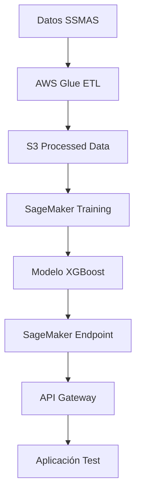

# Caso de Uso 1: Yield Predictivo - Fase I: PoC y Desarrollo del MVP

## Introducción a la Fase I

La Fase I del proyecto Yield Predictivo de SSMAS constituye la etapa fundamental de validación técnica y desarrollo del Producto Mínimo Viable (MVP). Esta fase está diseñada para demostrar la viabilidad técnica del modelo de machine learning propuesto en un entorno controlado de AWS, estableciendo los cimientos tecnológicos para las fases posteriores de operativización y optimización continua.

Durante esta fase, se desarrollará e implementará un sistema completo de predicción de CPM utilizando los servicios de AWS, validando tanto la arquitectura técnica como la efectividad del modelo XGBoost para las necesidades específicas de SSMAS.

## Objetivos de la Fase I

### Objetivo Principal
Desarrollar y validar un MVP completo del sistema de predicción de CPM en AWS, demostrando que el modelo XGBoost puede generar predicciones precisas y útiles para la optimización de yield publicitario de SSMAS.

### Objetivos Específicos
1. **Validación técnica**: Confirmar que la arquitectura AWS propuesta es viable para los requisitos de SSMAS
2. **Desarrollo del modelo**: Crear un modelo XGBoost entrenado con datos históricos reales de SSMAS
3. **Evaluación de performance**: Medir métricas de precisión (RMSE, MAE) y latencia del sistema
4. **Documentación completa**: Generar documentación técnica y de proceso para facilitar la siguiente fase
5. **Presentación de resultados**: Validar el MVP con stakeholders técnicos y de negocio

## Arquitectura Técnica de la Fase I

### Infraestructura AWS para MVP

#### Configuración de Entorno Aislado
**AWS Account**: Development Account (dedicada para PoC)
- **Región**: Europe (Dublin) - eu-west-1
- **VPC**: 10.2.0.0/16 (Development Environment)
- **Subnets**:
  - Públicas: 10.2.1.0/24, 10.2.2.0/24
  - Privadas: 10.2.10.0/24, 10.2.11.0/24
- **Security Groups**: Configuraciones restrictivas para PoC

#### Servicios AWS Utilizados

**Amazon S3**:
- **Bucket principal**: `ssmas-yield-poc-dev-{region}`
- **Estructura de datos**:
  ```
  s3://ssmas-yield-poc-dev-eu-west-1/
  ├── raw-data/
  │   ├── impressions/
  │   ├── auctions/
  │   └── user-data/
  ├── processed/
  │   ├── features/
  │   └── training-data/
  ├── models/
  │   ├── artifacts/
  │   └── versions/
  └── outputs/
      ├── predictions/
      └── metrics/
  ```

**AWS Glue**:
- **Catálogo de datos**: Definición de esquemas para datos de SSMAS
- **ETL Jobs**: Procesamiento y feature engineering
- **Conexiones**: Integración con fuente de datos Elastic

**Amazon SageMaker**:
- **Notebook Instance**: ml.t3.medium para desarrollo
- **Training Job**: ml.m5.xlarge para entrenamiento XGBoost
- **Endpoint**: ml.t2.medium para inferencia de PoC

### Flujo de Datos del MVP



## Diseño de Datos y Feature Engineering

### Datos de Entrada

#### Volumen para PoC
- **Muestra de datos**: 1 mes de datos históricos (aproximadamente 1.5 billones de registros)
- **Periodo**: Enero 2024 (más reciente y estacionalmente relevante)
- **Fuente**: API Elastic de SSMAS

#### Schema de Datos de Impresiones
```json
{
  "impression_id": "string",
  "timestamp": "datetime",
  "cpm": "float",
  "ad_unit": "string",
  "format": "string",
  "inventory_type": "string",
  "device_category": "string",
  "country": "string",
  "domain": "string",
  "bidder": "string",
  "demand_channel": "string",
  "revenue": "float",
  "impressions": "integer",
  "clicks": "integer",
  "ctr": "float"
}
```

#### Schema de Datos de Usuario
```json
{
  "user_id": "string",
  "browser": "string",
  "os": "string",
  "device_memory": "integer",
  "connection_downlink": "float",
  "screen_resolution": "string",
  "page_count": "integer",
  "referrer": "string",
  "traffic_source": "string",
  "is_mobile": "boolean"
}
```

### Feature Engineering con AWS Glue

#### Características Derivadas
**Temporales**:
- `hour_of_day`: Hora del día (0-23)
- `day_of_week`: Día de la semana (1-7)
- `is_weekend`: Booleano para fin de semana
- `hour_category`: Categorización en franjas horarias (mañana, tarde, noche)

**Geográficas**:
- `country_tier`: Clasificación de países por CPM histórico (Tier 1, 2, 3)
- `is_eu`: Booleano para países de la UE
- `timezone_offset`: Diferencia horaria con UTC

**Dispositivo y Contexto**:
- `device_performance_score`: Score basado en memoria y conexión
- `screen_category`: Categorización de resoluciones (mobile, tablet, desktop)
- `browser_family`: Agrupación de navegadores similares

**Inventario**:
- `ad_unit_performance`: CPM promedio histórico por unidad publicitaria
- `format_demand_ratio`: Ratio de demanda histórica por formato
- `inventory_scarcity`: Nivel de escasez del tipo de inventario

**Agregaciones Históricas**:
- `domain_avg_cpm_7d`: CPM promedio del dominio últimos 7 días
- `bidder_win_rate_30d`: Tasa de victoria del bidder últimos 30 días
- `user_engagement_score`: Score de engagement basado en pageCount y CTR histórico

#### Código AWS Glue Job
```python
import sys
from awsglue.transforms import *
from awsglue.utils import getResolvedOptions
from pyspark.context import SparkContext
from awsglue.context import GlueContext
from awsglue.job import Job
from pyspark.sql import functions as F
from pyspark.sql.types import *

args = getResolvedOptions(sys.argv, ['JOB_NAME'])
sc = SparkContext()
glueContext = GlueContext(sc)
spark = glueContext.spark_session
job = Job(glueContext)
job.init(args['JOB_NAME'], args)

# Lectura de datos raw
impressions_df = glueContext.create_dynamic_frame.from_catalog(
    database="ssmas_yield_poc",
    table_name="raw_impressions"
).toDF()

users_df = glueContext.create_dynamic_frame.from_catalog(
    database="ssmas_yield_poc",
    table_name="raw_users"
).toDF()

# Feature Engineering
processed_df = impressions_df.join(users_df, on="user_id", how="left")

# Características temporales
processed_df = processed_df.withColumn("hour_of_day", F.hour("timestamp"))
processed_df = processed_df.withColumn("day_of_week", F.dayofweek("timestamp"))
processed_df = processed_df.withColumn("is_weekend",
    F.when(F.col("day_of_week").isin([1, 7]), 1).otherwise(0))

# Características de dispositivo
processed_df = processed_df.withColumn("device_performance_score",
    F.col("device_memory") * F.col("connection_downlink"))

# Agregaciones históricas (ventana 7 días)
window_7d = Window.partitionBy("domain").rangeBetween(-7*24*3600, 0)
processed_df = processed_df.withColumn("domain_avg_cpm_7d",
    F.avg("cpm").over(window_7d))

# Escritura de datos procesados
output_path = "s3://ssmas-yield-poc-dev-eu-west-1/processed/features/"
processed_df.write.mode("overwrite").parquet(output_path)

job.commit()
```

## Desarrollo del Modelo XGBoost

### Configuración del Modelo

#### Hiperparámetros Iniciales
```python
hyperparameters = {
    'objective': 'reg:squarederror',
    'max_depth': 6,
    'learning_rate': 0.1,
    'n_estimators': 100,
    'min_child_weight': 1,
    'subsample': 0.8,
    'colsample_bytree': 0.8,
    'random_state': 42
}
```

#### Variables de Entrada (Features)
**Características principales** (35 features):
1. `hour_of_day`
2. `day_of_week`
3. `is_weekend`
4. `country_tier`
5. `device_category_encoded`
6. `format_encoded`
7. `inventory_type_encoded`
8. `bidder_encoded`
9. `demand_channel_encoded`
10. `device_performance_score`
11. `screen_category_encoded`
12. `browser_family_encoded`
13. `domain_avg_cpm_7d`
14. `bidder_win_rate_30d`
15. `user_engagement_score`
16. `ad_unit_performance`
17. `format_demand_ratio`
18. `inventory_scarcity`
19. `is_mobile`
20. `page_count`
21. `historical_ctr_avg`
22. `timezone_offset`
23. `connection_quality_tier`
24. `traffic_source_encoded`
25. `referrer_category_encoded`
26. `hour_category_encoded`
27. `seasonal_factor`
28. `day_performance_score`
29. `geo_demand_index`
30. `device_adoption_rate`
31. `format_competition_score`
32. `publisher_tier`
33. `audience_value_score`
34. `content_category_score`
35. `market_saturation_index`

#### Variable Objetivo
- `cpm`: Coste Por Mil impresiones (variable continua)

### Código de Entrenamiento en SageMaker

#### Script de Entrenamiento (`train.py`)
```python
import argparse
import joblib
import os
import pandas as pd
import xgboost as xgb
from sklearn.metrics import mean_squared_error, mean_absolute_error
from sklearn.model_selection import train_test_split
import numpy as np

def model_fn(model_dir):
    """Función para cargar el modelo en SageMaker"""
    model = joblib.load(os.path.join(model_dir, "model.joblib"))
    return model

def train():
    parser = argparse.ArgumentParser()

    # Hiperparámetros
    parser.add_argument('--max_depth', type=int, default=6)
    parser.add_argument('--learning_rate', type=float, default=0.1)
    parser.add_argument('--n_estimators', type=int, default=100)
    parser.add_argument('--min_child_weight', type=int, default=1)
    parser.add_argument('--subsample', type=float, default=0.8)
    parser.add_argument('--colsample_bytree', type=float, default=0.8)

    # Rutas de SageMaker
    parser.add_argument('--model_dir', type=str, default=os.environ['SM_MODEL_DIR'])
    parser.add_argument('--train', type=str, default=os.environ['SM_CHANNEL_TRAIN'])
    parser.add_argument('--validation', type=str, default=os.environ['SM_CHANNEL_VALIDATION'])

    args = parser.parse_args()

    # Cargar datos
    train_df = pd.read_parquet(os.path.join(args.train, 'train.parquet'))
    val_df = pd.read_parquet(os.path.join(args.validation, 'validation.parquet'))

    # Separar features y target
    feature_cols = [col for col in train_df.columns if col != 'cpm']
    X_train = train_df[feature_cols]
    y_train = train_df['cpm']
    X_val = val_df[feature_cols]
    y_val = val_df['cpm']

    # Configurar modelo XGBoost
    model = xgb.XGBRegressor(
        max_depth=args.max_depth,
        learning_rate=args.learning_rate,
        n_estimators=args.n_estimators,
        min_child_weight=args.min_child_weight,
        subsample=args.subsample,
        colsample_bytree=args.colsample_bytree,
        random_state=42,
        objective='reg:squarederror'
    )

    # Entrenar modelo
    model.fit(
        X_train, y_train,
        eval_set=[(X_val, y_val)],
        early_stopping_rounds=10,
        verbose=True
    )

    # Predicciones y métricas
    y_pred = model.predict(X_val)
    rmse = np.sqrt(mean_squared_error(y_val, y_pred))
    mae = mean_absolute_error(y_val, y_pred)

    print(f"Validation RMSE: {rmse:.4f}")
    print(f"Validation MAE: {mae:.4f}")

    # Guardar modelo
    joblib.dump(model, os.path.join(args.model_dir, "model.joblib"))

    # Guardar métricas
    metrics = {
        'rmse': rmse,
        'mae': mae,
        'feature_importance': dict(zip(feature_cols, model.feature_importances_))
    }

    with open(os.path.join(args.model_dir, "metrics.json"), 'w') as f:
        import json
        json.dump(metrics, f)

if __name__ == '__main__':
    train()
```

#### Configuración del Training Job
```python
import sagemaker
from sagemaker.xgboost import XGBoost

# Configuración del estimador
xgb_estimator = XGBoost(
    entry_point='train.py',
    role=sagemaker.get_execution_role(),
    instance_type='ml.m5.xlarge',
    instance_count=1,
    framework_version='1.3-1',
    py_version='py3',
    hyperparameters={
        'max_depth': 6,
        'learning_rate': 0.1,
        'n_estimators': 200,
        'min_child_weight': 1,
        'subsample': 0.8,
        'colsample_bytree': 0.8
    }
)

# Rutas de datos
train_input = sagemaker.inputs.TrainingInput(
    s3_data='s3://ssmas-yield-poc-dev-eu-west-1/processed/train/',
    content_type='application/x-parquet'
)

validation_input = sagemaker.inputs.TrainingInput(
    s3_data='s3://ssmas-yield-poc-dev-eu-west-1/processed/validation/',
    content_type='application/x-parquet'
)

# Ejecutar entrenamiento
xgb_estimator.fit({
    'train': train_input,
    'validation': validation_input
})
```

## Implementación del Endpoint de Inferencia

### Configuración del Endpoint

#### Script de Predicción (`inference.py`)
```python
import joblib
import json
import numpy as np
import pandas as pd
import os

def model_fn(model_dir):
    """Cargar el modelo entrenado"""
    model = joblib.load(os.path.join(model_dir, "model.joblib"))
    return model

def input_fn(request_body, request_content_type):
    """Procesar datos de entrada"""
    if request_content_type == 'application/json':
        input_data = json.loads(request_body)
        return pd.DataFrame([input_data])
    else:
        raise ValueError(f"Unsupported content type: {request_content_type}")

def predict_fn(input_data, model):
    """Realizar predicción"""
    prediction = model.predict(input_data)
    return prediction

def output_fn(prediction, content_type):
    """Formatear salida"""
    if content_type == 'application/json':
        return json.dumps({
            'predicted_cpm': float(prediction[0]),
            'confidence_interval': {
                'lower': float(prediction[0] * 0.9),
                'upper': float(prediction[0] * 1.1)
            }
        })
    else:
        raise ValueError(f"Unsupported content type: {content_type}")
```

#### Despliegue del Endpoint
```python
# Desplegar modelo como endpoint
predictor = xgb_estimator.deploy(
    initial_instance_count=1,
    instance_type='ml.t2.medium',
    endpoint_name='ssmas-yield-predictor-poc'
)

# Configurar predictor
predictor.content_type = 'application/json'
predictor.accept = 'application/json'
```

### API Gateway para Integración

#### Configuración de API Gateway
```yaml
openapi: 3.0.0
info:
  title: SSMAS Yield Predictor API
  version: 1.0.0
paths:
  /predict:
    post:
      summary: Predict CPM
      requestBody:
        required: true
        content:
          application/json:
            schema:
              type: object
              properties:
                hour_of_day:
                  type: integer
                  minimum: 0
                  maximum: 23
                day_of_week:
                  type: integer
                  minimum: 1
                  maximum: 7
                country_tier:
                  type: integer
                  minimum: 1
                  maximum: 3
                device_category:
                  type: string
                  enum: [mobile, tablet, desktop]
                # ... resto de parámetros
      responses:
        '200':
          description: Predicción exitosa
          content:
            application/json:
              schema:
                type: object
                properties:
                  predicted_cpm:
                    type: number
                  confidence_interval:
                    type: object
```

#### Lambda de Integración
```python
import json
import boto3
import numpy as np

sagemaker_runtime = boto3.client('sagemaker-runtime')

def lambda_handler(event, context):
    try:
        # Extraer datos del request
        request_body = json.loads(event['body'])

        # Validar datos de entrada
        required_fields = [
            'hour_of_day', 'day_of_week', 'country_tier',
            'device_category', 'format', 'inventory_type'
        ]

        for field in required_fields:
            if field not in request_body:
                return {
                    'statusCode': 400,
                    'body': json.dumps({
                        'error': f'Missing required field: {field}'
                    })
                }

        # Preparar datos para predicción
        payload = json.dumps(request_body)

        # Llamar a SageMaker endpoint
        response = sagemaker_runtime.invoke_endpoint(
            EndpointName='ssmas-yield-predictor-poc',
            ContentType='application/json',
            Body=payload
        )

        # Procesar respuesta
        result = json.loads(response['Body'].read().decode())

        return {
            'statusCode': 200,
            'headers': {
                'Content-Type': 'application/json',
                'Access-Control-Allow-Origin': '*'
            },
            'body': json.dumps(result)
        }

    except Exception as e:
        return {
            'statusCode': 500,
            'body': json.dumps({
                'error': str(e)
            })
        }
```

## Testing y Validación

### Métricas de Evaluación

#### Métricas de Precisión del Modelo
1. **RMSE (Root Mean Square Error)**:
   - Objetivo: < 0.50 EUR (para CPMs promedio de 2-3 EUR)
   - Medición: Diferencia cuadrática media entre predicción y valor real

2. **MAE (Mean Absolute Error)**:
   - Objetivo: < 0.30 EUR
   - Medición: Diferencia absoluta promedio

3. **MAPE (Mean Absolute Percentage Error)**:
   - Objetivo: < 15%
   - Medición: Error porcentual respecto al valor real

4. **R² Score**:
   - Objetivo: > 0.75
   - Medición: Coeficiente de determinación

#### Métricas de Rendimiento del Sistema
1. **Latencia de Predicción**:
   - Objetivo: < 50ms percentil 95
   - Medición: Tiempo de respuesta del endpoint

2. **Throughput**:
   - Objetivo: > 1000 predicciones/segundo
   - Medición: Capacidad de procesamiento

3. **Disponibilidad**:
   - Objetivo: > 99.5%
   - Medición: Uptime del endpoint

### Scripts de Testing

#### Test de Precisión del Modelo
```python
import pandas as pd
import numpy as np
from sklearn.metrics import mean_squared_error, mean_absolute_error, r2_score
import joblib

def evaluate_model_performance():
    # Cargar datos de test
    test_df = pd.read_parquet('s3://ssmas-yield-poc-dev-eu-west-1/processed/test/')

    # Cargar modelo
    model = joblib.load('model.joblib')

    # Separar features y target
    feature_cols = [col for col in test_df.columns if col != 'cpm']
    X_test = test_df[feature_cols]
    y_test = test_df['cpm']

    # Predicciones
    y_pred = model.predict(X_test)

    # Calcular métricas
    rmse = np.sqrt(mean_squared_error(y_test, y_pred))
    mae = mean_absolute_error(y_test, y_pred)
    mape = np.mean(np.abs((y_test - y_pred) / y_test)) * 100
    r2 = r2_score(y_test, y_pred)

    metrics = {
        'rmse': rmse,
        'mae': mae,
        'mape': mape,
        'r2_score': r2
    }

    print("Model Performance Metrics:")
    print(f"RMSE: {rmse:.4f}")
    print(f"MAE: {mae:.4f}")
    print(f"MAPE: {mape:.2f}%")
    print(f"R² Score: {r2:.4f}")

    return metrics

if __name__ == "__main__":
    evaluate_model_performance()
```

#### Test de Latencia del Endpoint
```python
import time
import json
import boto3
import numpy as np
from concurrent.futures import ThreadPoolExecutor

sagemaker_runtime = boto3.client('sagemaker-runtime')

def single_prediction():
    """Realizar una predicción individual"""
    test_data = {
        'hour_of_day': 14,
        'day_of_week': 3,
        'country_tier': 1,
        'device_category_encoded': 1,
        'format_encoded': 2,
        'inventory_type_encoded': 1,
        'device_performance_score': 150.5,
        'domain_avg_cpm_7d': 2.45
    }

    start_time = time.time()

    response = sagemaker_runtime.invoke_endpoint(
        EndpointName='ssmas-yield-predictor-poc',
        ContentType='application/json',
        Body=json.dumps(test_data)
    )

    end_time = time.time()
    latency = (end_time - start_time) * 1000  # en milisegundos

    return latency

def load_test(num_requests=1000, num_threads=10):
    """Test de carga con múltiples requests"""
    latencies = []

    with ThreadPoolExecutor(max_workers=num_threads) as executor:
        futures = [executor.submit(single_prediction) for _ in range(num_requests)]

        for future in futures:
            latency = future.result()
            latencies.append(latency)

    # Calcular estadísticas
    stats = {
        'mean_latency': np.mean(latencies),
        'median_latency': np.median(latencies),
        'p95_latency': np.percentile(latencies, 95),
        'p99_latency': np.percentile(latencies, 99),
        'max_latency': np.max(latencies),
        'min_latency': np.min(latencies)
    }

    print("Latency Test Results:")
    print(f"Mean: {stats['mean_latency']:.2f}ms")
    print(f"Median: {stats['median_latency']:.2f}ms")
    print(f"P95: {stats['p95_latency']:.2f}ms")
    print(f"P99: {stats['p99_latency']:.2f}ms")
    print(f"Max: {stats['max_latency']:.2f}ms")
    print(f"Min: {stats['min_latency']:.2f}ms")

    return stats

if __name__ == "__main__":
    load_test()
```

## Monitorización y Logging

### CloudWatch Configuration

#### Métricas Personalizadas
```python
import boto3
import time

cloudwatch = boto3.client('cloudwatch')

def publish_custom_metrics(rmse, mae, latency):
    """Publicar métricas personalizadas a CloudWatch"""

    # Métricas del modelo
    cloudwatch.put_metric_data(
        Namespace='SSMAS/YieldPredictor',
        MetricData=[
            {
                'MetricName': 'ModelRMSE',
                'Value': rmse,
                'Unit': 'None',
                'Timestamp': time.time()
            },
            {
                'MetricName': 'ModelMAE',
                'Value': mae,
                'Unit': 'None',
                'Timestamp': time.time()
            },
            {
                'MetricName': 'PredictionLatency',
                'Value': latency,
                'Unit': 'Milliseconds',
                'Timestamp': time.time()
            }
        ]
    )
```

#### Dashboard de CloudWatch
```json
{
    "widgets": [
        {
            "type": "metric",
            "properties": {
                "metrics": [
                    ["SSMAS/YieldPredictor", "ModelRMSE"],
                    [".", "ModelMAE"]
                ],
                "period": 300,
                "stat": "Average",
                "region": "eu-west-1",
                "title": "Model Accuracy Metrics"
            }
        },
        {
            "type": "metric",
            "properties": {
                "metrics": [
                    ["AWS/SageMaker", "Invocations", "EndpointName", "ssmas-yield-predictor-poc"],
                    [".", "ModelLatency", ".", "."]
                ],
                "period": 300,
                "stat": "Average",
                "region": "eu-west-1",
                "title": "Endpoint Performance"
            }
        }
    ]
}
```

### Logging Configuration
```python
import logging
import boto3
import json

# Configurar logging
logging.basicConfig(
    level=logging.INFO,
    format='%(asctime)s - %(name)s - %(levelname)s - %(message)s'
)

logger = logging.getLogger('ssmas-yield-predictor')

def log_prediction(input_data, prediction, latency):
    """Log de predicciones para análisis posterior"""
    log_entry = {
        'timestamp': time.time(),
        'input_features': input_data,
        'predicted_cpm': prediction,
        'latency_ms': latency,
        'model_version': '1.0.0'
    }

    logger.info(f"Prediction: {json.dumps(log_entry)}")
```

## Seguridad y Compliance

### Configuración de IAM

#### Rol para SageMaker
```json
{
    "Version": "2012-10-17",
    "Statement": [
        {
            "Effect": "Allow",
            "Action": [
                "s3:GetObject",
                "s3:PutObject",
                "s3:ListBucket"
            ],
            "Resource": [
                "arn:aws:s3:::ssmas-yield-poc-dev-eu-west-1",
                "arn:aws:s3:::ssmas-yield-poc-dev-eu-west-1/*"
            ]
        },
        {
            "Effect": "Allow",
            "Action": [
                "logs:CreateLogGroup",
                "logs:CreateLogStream",
                "logs:PutLogEvents"
            ],
            "Resource": "*"
        }
    ]
}
```

#### Rol para Lambda
```json
{
    "Version": "2012-10-17",
    "Statement": [
        {
            "Effect": "Allow",
            "Action": [
                "sagemaker:InvokeEndpoint"
            ],
            "Resource": "arn:aws:sagemaker:eu-west-1:*:endpoint/ssmas-yield-predictor-poc"
        },
        {
            "Effect": "Allow",
            "Action": [
                "logs:CreateLogGroup",
                "logs:CreateLogStream",
                "logs:PutLogEvents"
            ],
            "Resource": "*"
        }
    ]
}
```

### Cifrado de Datos

#### S3 Bucket Encryption
```yaml
BucketEncryption:
  ServerSideEncryptionConfiguration:
    - ServerSideEncryptionByDefault:
        SSEAlgorithm: aws:kms
        KMSMasterKeyID: !Ref YieldPredictorKMSKey
      BucketKeyEnabled: true
```

#### SageMaker Encryption
```python
# Configuración de cifrado para training job
xgb_estimator = XGBoost(
    # ... otras configuraciones
    volume_kms_key='arn:aws:kms:eu-west-1:account:key/key-id',
    output_kms_key='arn:aws:kms:eu-west-1:account:key/key-id',
    enable_network_isolation=True
)
```

## Estimación de Costos de la Fase I

### Desglose de Costos AWS

#### Servicios Principales
1. **Amazon S3**:
   - Almacenamiento: 100GB × $0.023/GB = $2.30/mes
   - Requests: 10M requests × $0.0004/1000 = $4.00/mes
   - **Total S3**: $6.30/mes

2. **Amazon SageMaker**:
   - Notebook (ml.t3.medium): 40 horas × $0.0464/hora = $1.86
   - Training (ml.m5.xlarge): 10 horas × $0.230/hora = $2.30
   - Endpoint (ml.t2.medium): 720 horas × $0.065/hora = $46.80
   - **Total SageMaker**: $50.96/mes

3. **AWS Glue**:
   - ETL Jobs: 20 DPU-horas × $0.44/DPU-hora = $8.80
   - Catálogo: 1M requests × $1.00/1M = $1.00
   - **Total Glue**: $9.80/mes

4. **API Gateway**:
   - Requests: 1M requests × $3.50/1M = $3.50/mes
   - **Total API Gateway**: $3.50/mes

5. **AWS Lambda**:
   - Invocaciones: 1M × $0.20/1M = $0.20
   - Duración: 1M × 100ms × $0.0000166667/GB-segundo = $1.67
   - **Total Lambda**: $1.87/mes

6. **CloudWatch**:
   - Métricas personalizadas: 50 × $0.30 = $15.00
   - Logs: 10GB × $0.50/GB = $5.00
   - **Total CloudWatch**: $20.00/mes

#### **Costo Total Estimado Fase I**: $92.43/mes

### Optimizaciones de Costo
1. **Uso de Spot Instances** para training jobs: -60% costo
2. **Auto Scaling** para endpoint según demanda: -40% costo
3. **Lifecycle policies** en S3: -30% costo de almacenamiento
4. **Reserved Instances** para recursos persistentes: -20% costo

## Cronograma Detallado de la Fase I

### Semana 1: Setup y Configuración
**Días 1-2: Infraestructura**
- Configuración de AWS Account Development
- Creación de VPC y subnets
- Setup de Security Groups y NACLs
- Configuración de IAM roles y políticas

**Días 3-4: Servicios de Datos**
- Configuración de S3 buckets con encryption
- Setup de AWS Glue catálogo
- Configuración de conexiones a fuente Elastic
- Testing de conectividad

**Día 5: Documentación**
- Documentación de arquitectura implementada
- Scripts de configuración versionados
- Review de seguridad inicial

### Semana 2: Ingesta y Procesamiento
**Días 1-2: Ingesta de Datos**
- Desarrollo de scripts de ingesta desde Elastic
- Implementación de validación de datos
- Setup de monitorización de ingesta

**Días 3-4: Feature Engineering**
- Desarrollo del job de AWS Glue
- Implementación de feature engineering
- Testing y validación de transformaciones

**Día 5: Optimización**
- Optimización de performance del ETL
- Testing de volumetría
- Ajustes de configuración

### Semana 3: Desarrollo del Modelo
**Días 1-2: Preparación de Datos**
- División de datos en train/validation/test
- Análisis exploratorio de datos
- Validación de calidad de features

**Días 3-4: Entrenamiento**
- Desarrollo del script de entrenamiento
- Configuración de SageMaker training job
- Primer entrenamiento y evaluación

**Día 5: Optimización del Modelo**
- Tuning de hiperparámetros
- Validación cruzada
- Análisis de feature importance

### Semana 4: Deployment y Testing
**Días 1-2: Endpoint de Inferencia**
- Desarrollo del script de inferencia
- Deployment del endpoint SageMaker
- Testing básico de funcionalidad

**Días 3-4: API Gateway e Integración**
- Configuración de API Gateway
- Desarrollo de Lambda de integración
- Testing end-to-end

**Día 5: Testing de Performance**
- Load testing del endpoint
- Validación de latencia
- Métricas de throughput

### Semana 5: Monitorización y Documentación
**Días 1-2: Monitorización**
- Configuración de CloudWatch dashboards
- Setup de alertas automáticas
- Testing de logging

**Días 3-4: Documentación Final**
- Documentación técnica completa
- Manual de usuario de APIs
- Playbooks operacionales

**Día 5: Presentación y Validación**
- Preparación de demo
- Presentación a stakeholders
- Validación de MVP

### Semana 6: Refinamiento y Handover
**Días 1-3: Refinamiento**
- Ajustes basados en feedback
- Optimizaciones finales
- Testing adicional si necesario

**Días 4-5: Handover**
- Transferencia de conocimiento
- Documentación de transición
- Preparación para Fase II

## Criterios de Éxito de la Fase I

### Criterios Técnicos
1. **Modelo Entrenado Exitosamente**:
   - RMSE < 0.50 EUR en dataset de validación
   - R² Score > 0.75
   - Feature importance alineada con conocimiento de dominio

2. **Endpoint Funcionando**:
   - Latencia P95 < 50ms
   - Throughput > 1000 predictions/segundo
   - Disponibilidad > 99.5% durante período de testing

3. **Integración API Completa**:
   - API Gateway respondiendo correctamente
   - Lambda procesando requests sin errores
   - Documentación API actualizada

4. **Monitorización Operativa**:
   - Dashboard CloudWatch configurado
   - Alertas funcionando correctamente
   - Logs estructurados y accesibles

### Criterios de Negocio
1. **Validación de Caso de Uso**:
   - Demostración que el modelo puede predecir CPM con precisión útil
   - Validación que las predicciones pueden influir decisiones de pricing
   - Confirmación de viabilidad técnica para escalabilidad

2. **ROI Técnico**:
   - Costos de infraestructura dentro de presupuesto ($100/mes)
   - Performance adecuada para volumetría esperada
   - Arquitectura escalable hacia Fase II

3. **Stakeholder Buy-in**:
   - Aprobación técnica del equipo de desarrollo
   - Validación de métricas por equipo de negocio
   - Green light para proceder a Fase II

## Entregables de la Fase I

### Entregables Técnicos
1. **Código Fuente**:
   - Scripts de AWS Glue para ETL
   - Código de entrenamiento de SageMaker
   - Scripts de inferencia
   - Lambda functions
   - Configuraciones de infraestructura

2. **Modelo Entrenado**:
   - Artefacto del modelo XGBoost en S3
   - Métricas de evaluación documentadas
   - Feature importance analysis
   - Validation report

3. **Infraestructura**:
   - VPC y networking configurado
   - Endpoints SageMaker funcionando
   - API Gateway configurado
   - Monitorización implementada

### Entregables de Documentación
1. **Documentación Técnica**:
   - Arquitectura de solución detallada
   - Manual de deployment
   - Guía de operaciones
   - API documentation

2. **Reportes de Performance**:
   - Métricas de precisión del modelo
   - Benchmarks de latencia y throughput
   - Análisis de costos
   - Recomendaciones de optimización

3. **Documentación de Proceso**:
   - Workflow de feature engineering
   - Proceso de entrenamiento
   - Procedimientos de deployment
   - Runbooks operacionales

### Presentación Final
1. **Demo del Sistema**:
   - Predicción en tiempo real
   - Dashboard de monitorización
   - Métricas de performance

2. **Resultados y Análisis**:
   - Evaluación vs. objetivos
   - Lecciones aprendidas
   - Recomendaciones para Fase II

3. **Próximos Pasos**:
   - Roadmap hacia Fase II
   - Mejoras identificadas
   - Escalabilidad considerations

## Conclusión de la Fase I

La Fase I del proyecto Yield Predictivo establece los cimientos técnicos fundamentales para la transformación de SSMAS hacia un modelo de optimización publicitaria predictiva. A través del desarrollo de un MVP completo en AWS, esta fase valida tanto la viabilidad técnica como el valor de negocio de la solución propuesta.

El enfoque metodológico de la Fase I, centrado en una implementación controlada y medible, asegura que todos los componentes críticos del sistema (ingesta de datos, feature engineering, modelo ML, y endpoint de inferencia) sean desarrollados siguiendo las mejores prácticas de AWS y las necesidades específicas de SSMAS.

Los resultados exitosos de esta fase proporcionarán la confianza y el conocimiento técnico necesario para proceder hacia la Fase II, donde el sistema se operativizará a escala completa, estableciendo a SSMAS como líder tecnológico en el sector AdTech español.

La inversión en esta fase no solo valida la propuesta técnica, sino que también construye las capacidades internas del equipo SSMAS en tecnologías de machine learning en AWS, estableciendo una base sólida para futuras innovaciones en el campo de la optimización publicitaria predictiva.